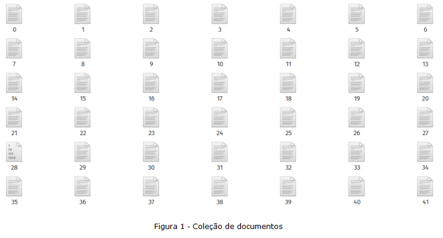
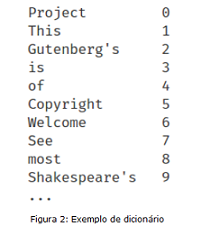
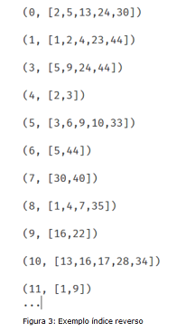
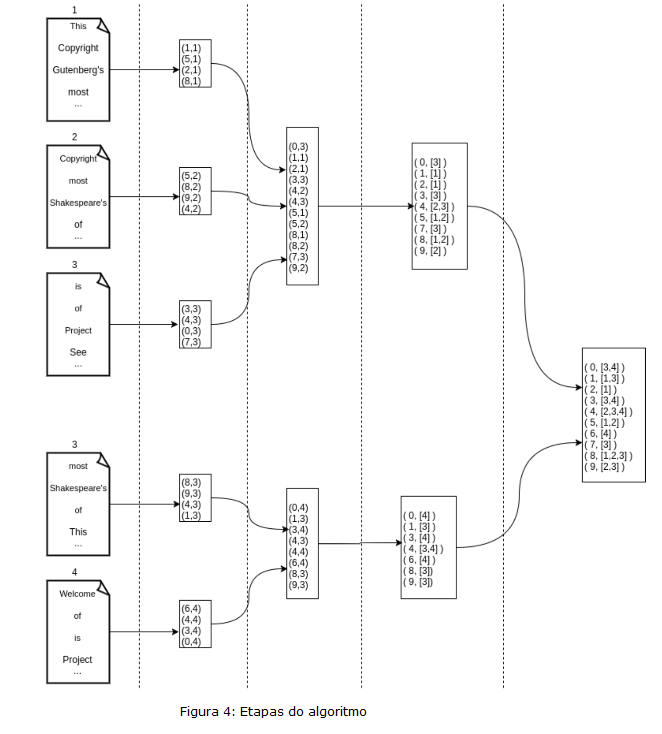

# Blocked sort-based indexing implementation for big-data servers
Data Engineering project.
## Reference: Standford Edu IR-BOOK
https://nlp.stanford.edu/IR-book/html/htmledition/blocked-sort-based-indexing-1.html#:~:text=One%20solution%20is%20the%20blocked,results%20into%20the%20final%20index.

## 2 - Algoritm
### 2.1 Documents

We have a collection of N documents. In our case, we have 1 file per document and the file name is simply the document's index number, as shown in figure 1. 
 
 

### 2.2 Dictionary

We want a dictionary that performs a ** “match” ** of each word contained in the documents with a unique identifier ** “word_id” **, as shown in figure 2.
 
 

### 2.2.1 Reverse index

Using both the data set and the dictionary, we were able to build a reverse index that gives, for each word, the list of documents in which the word is contained, see figure 3.2.
 
 
 
  

We want a solution that works for a large data set.

These are the 4 steps of the algorithm:

1. Read the documents and retrieve each pair (** wordId **, ** documentId **)
2. Sort each pair by ** worldId ** and ** documentId **
3. For each ** worldId **, group the pairs, to have the list of documents containing the word
4. Merge the intermediate results to have the final reverse index

See figure 4, steps of the algorithm
 
 

** Attention **: the index must be ordered by the word identifiers and for each word identifier, order its respective list of document identifiers.  

## 3 - Information

You will find the document dataset in the * dataset * directory of the repository on GitHub.

1. Implement a * Job * to build the dictionary. Each line of the output file must be the word followed by its identifier (** world_id **). In documents stored in the * dataset * directory, words are separated by one or more spaces.
2. Implement one or more * Jobs * to build the reverse index

You must use either ** PySpark or Pure Python ** for these * Jobs *
